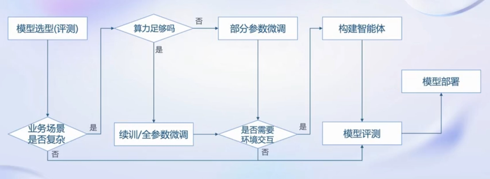
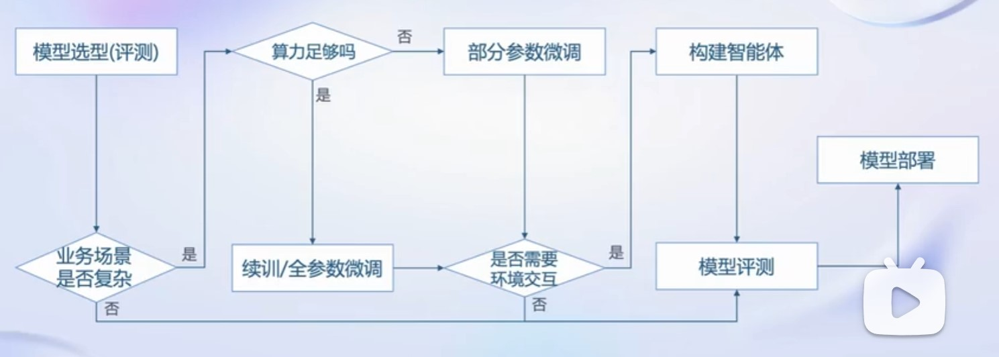

# 书生·浦语大模型全链路开源体系
**大模型成为发展通用人工智呢的重要途径**
从专用模型到通用大模型
## 书生·浦语大模型系列
轻量级：InternLM-7B，社区低成本可用最佳模型规模
重量级：InternLM-20B，商业场景可开发定制高精度较小模型规模
重量级：InternLm-123B，通用大模型能力全面覆盖千亿模型规模
## 从模型到应用

## 全链条开放体系
#### 数据：
**书生·万卷1.0**：文本数据，图文数据集，视频数据；多模态融合，精细化处理，价值观对齐
**opendatalab**：
#### 预训练
**高可扩展，极致性能优化，兼容主流，开箱即用**
#### 微调
**增量续训，有监督微调**:全量参数微调，部分参数微调
**XTuner**：高效微调框架
#### 评测
##### OpenCompass
**学科，语言，知识，理解，推理。安全**

#### 部署
**大语言模型特点**：内存开销巨大，动态shape，transformer结构，大部分是Decoder-only
**技术挑战**：低存储设备，加速tokens生成，解决动态shape，有效管理利用内存，提升吞吐量，降低响应时间
**部署方案**：模型并行，低比特量化，Attention优化，计算和访存优化，Continuous Batching
##### LMDeploy
### 智能体Agent
**大语言模型的局限性**：最新知识和信息的获取，回复的可靠性，数学计算，工具交互和使用
##### Lagent框架，AgentLego智能体工具集合